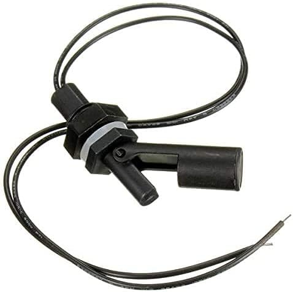
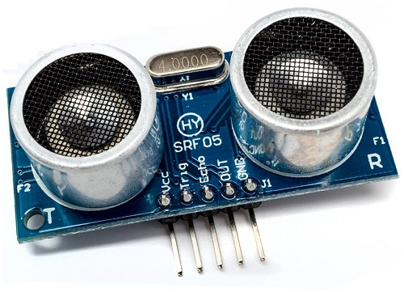

# Dispenser

# Specifiche tecniche

Il dispenser dovrà essere realizzato con materiali semplici. Alla sua sommittà avrà un contenitore di 5L. La gestione dell'erogazione dovrà essere fatta mediante una scheda arduino e sensori di livello e prossimità.

## Componenti

Il tank sarà dotato di un [interruttore di livello](https://www.amazon.it/HeyNana-Professionale-Orizzontale-Galleggiante-Interruttore/dp/B092RDHD33/ref=sr_1_10?__mk_it_IT=%C3%85M%C3%85%C5%BD%C3%95%C3%91&crid=8NI79WG5V3W0&dib=eyJ2IjoiMSJ9.caQlodmXF27rFb6HHKpAm3nKw43fMJdWZs3rr-PVYytR1utZl8QErfRq_PB2TxF_tcAJK3m94_Yw6ms1pQtjVmQsyJiHKlQ6410xK3jza2W7LyVcLNRKulc0iVBY8lsxxSyOr2TUenqF02kqZqxZ12hAKO-CpOkWJFpe6xeYHHrDjuLNxWfy5ukSRQKh3y_0sNWC3Kb9v69Sm8WzLxPf3EnVe8J-7Gdu78AqVvYovp4oZvLQ8H3ejojM1sUEZVvirAmWnwx3vb_WQoBI92ETb1K_KZ-6PIDkRPM6505Yuvo.-4VwA58auWtILwHKFTvttqWOAJe1O0lrEQv2MYaK9Pw&dib_tag=se&keywords=interruttore+di+livello+arduino&qid=1718211210&sprefix=interruttore+di+livello+arduino%2Caps%2C129&sr=8-10). Quello posto sulla sommità del tank prenderà il nome di ***SLp** (Sensore di Livello di Pieno).*

Nella struttura a lato del punto dove verrà posto il bicchiere sarà invece presente un sensore ad ultrasuoni del Kit Arduino per verificarne la presenza. Questo sarà chiamato ***Si** (Sensore ad Infrarosso)*.

L'acqua verrà caricata tramite una [pompa ad immersione](https://www.amazon.it/RUNCCI-YUN-Sommergibile-Sommersa-Trasparente-Flessibile/dp/B082PM8L6X/ref=sr_1_1?dib=eyJ2IjoiMSJ9.BvDnZOOEMe1jbq75fCUEGipr3fJHY_d6swHJyezsbH4UdO7TOfMiEIXU7w-4LtpRue8jSVjoeA0EqP4BrmAI698Acxgn_M5ew70pYa0jW_ViLIMgZTl13r_xlVoH5NS6WJ_kjiwDZgU8u5G42dHxrm_6s7WR0HxfVAgMmKlZJZzZ5bYzzXpakWc7XPgsa7nxjSCk8MazzJU2vm6Bj0f7newf08lANMCpFHLZdLq3gyqL7RKohShidx7iC76GTxYgMUmBx2W2vqacMQ3VCZR9avDxFN2LzhJQ7kzRO_5oXt8.YoRuR59_DLxdLE3QKRcPlJOchHAiYgcXpj7ixXlfN3I&dib_tag=se&keywords=arduino%2Bpump&qid=1718210361&sr=8-1&th=1) che pescherà l'acqua da un [tank da 5L](https://www.amazon.it/MARTEN-Marten-Acqua-demineralizzata-5L/dp/B06WVTDVFP/ref=sr_1_7?crid=3E8DSW908P8MC&dib=eyJ2IjoiMSJ9.W4lndhLax4vJEc1TGPmJe5CK1JppvqNF8geCVDVOix0R4e3mVDkiyg7aJxedYxHnH5uiT5PPuFUamHLDw-12nSiiHNkaQ_eT3XCSDHAHpvk3LDBykUi6jA7LySfFWiM1hJoRUEqaoXnB7ljUZoDz_X9HMbf4wpej2-gj31gMMhtWO1mE7x5jgVkl95I_ACmJyuPIlZrJKTZdVWTHzLOnDyJJt1mG4SbmNalHIcUPHSvffpNSfxHQboykTGIO1uZOMuaIpiTQmW0zwH7HUivCoJV0lWy6XimRD70xRXwd9zA.3T87neEwXo6vxkNqEWT_fSWy51aFrLC0pLg_yLb-lZY&dib_tag=se&keywords=5l+acqua&qid=1718211880&sprefix=5L%2Caps%2C127&sr=8-7) posto esternamente.

### Analisi dei costi

Boccione:		10 €

Arduino: 		gratis

Sensore Infra:	gratis

Modulo BT:	10 €

Interruttore:	8 €

Pompa:		11 €

**Totale:		40 €**

## Circuito Hardware

Verrà usata una scheda [Arduino one R3](https://www.arduino.cc/en/uploads/Main/Arduino_Uno_Rev3-schematic.pdf) con il [Bluetooth Module HC-05](https://www.amazon.it/DSD-TECH-BT-05-Bluetooth-classico/dp/B09NKYV3D7/ref=sr_1_3?__mk_it_IT=%C3%85M%C3%85%C5%BD%C3%95%C3%91&crid=CYC2WTNDMKCY&dib=eyJ2IjoiMSJ9.dfNm6aF8fYLQ3BUCasp5xaYRxTrlIDJrTk2Z6C7z6SpDJtOugyE825Kr638QCeWCdyo1nEMXCMjeTtCud98a7uH9nePnjh3r6yp5pDAhq80RsfudRdPrSGqegNe0g0O8ndjOzNNxuxrO9bKDd4GaIq6tlr6yY2uO65Cpjbj_BOrtKrb4jsT12VgQ5PThj_z3vS2Cm4vu7yudBr75hot_Q5E9VUNq_dWU0dy1r1bwxNaWRVqmlt-sYc2rWr2mR5O0vkqaTCY9IB7yZkthWC-4LSYVL4Cl1QSaX_EbYt1bodM.06H6XabNnLjwVFC5Us7cZXMNF-loPiDT3RTnVf1qPns&dib_tag=se&keywords=Bluetooth+Module+HC-05&qid=1718213683&sprefix=bluetooth+module+hc-05%2Caps%2C118&sr=8-3) ([link esempio](https://makersportal.com/blog/2018/10/30/4-pin-rgb-led-control-using-ios-blexar-app-hm-10-bluetooth-module-and-arduino)). 

